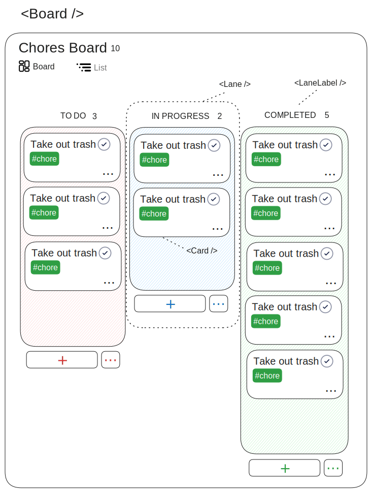

# Local Kanban

A task management kanban board with list view, CSV import/export, and Markdown support. Runs _completely offline_ and stores your data in your browsers IndexedDb with the option to save a local file and import from that save file.

## Concept Art



...


## Rework 
Started doing a rework to basically start from fresh. Here's some notes--

### LocalStorage setup
```ts
{
  boards: string[],
  [boardName: string]: {
    title: string,
    sortProperty: string,
    description?: string,
    notes?: string,
    laneConfig: {
      title: string,
      sortValue: string,
      description?: string,
      bg?: string
    }[],
    cards: {
      title: string,
      description? string,
      tags: string[],
      properties: Record<string, any>,
      notes?: string.
    }
  }
  theme: 'system' | 'dark' | 'light',
  accent: 'TO DO',
  bg: 'TO DO'
}
```

- [ ] SaveProvider
  - [ ] boards
  - [ ] updateBoards
  - [ ] updateBoardById
  - [ ] theme
  - [ ] themeStyle
  - [ ] accent
  - [ ] bg
- [ ] Break out components
  - [ ] App → Body → Main (needs broken up)   
